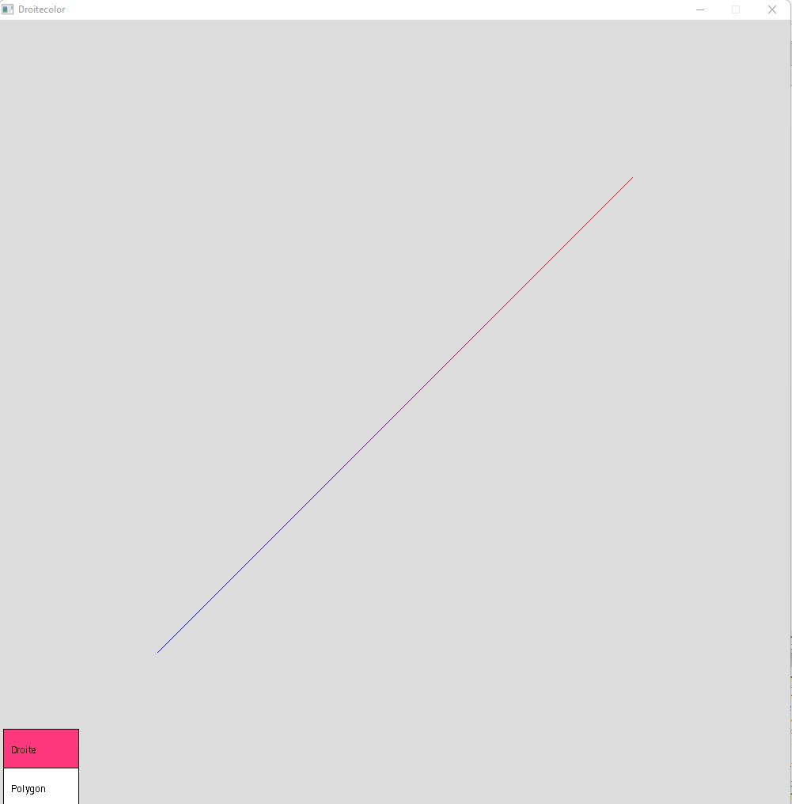
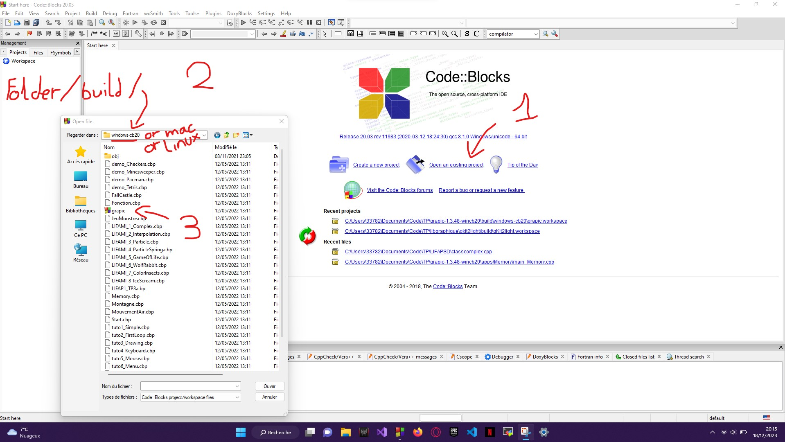

# Interpolation

The right

Consider two points on the 2D plane A and B. The temperature of A is Ta and that of B is Tb. The right
passing through A and direction vector AB can be represented by a parametric equation
which is very practical for doing linear interpolation.



# Subject

```
1. Give this parametric equation.
Use this equation to calculate the temperature along the line by interpolation
linear. The temperature -30°C is represented by blue (0, 0, 255), the temperature
+40°C is represented by red (255.0.0).
   
2. Write the Color structure comprising 3 components R, G and B. You can write the
operators +, *: Color operator+(Color a, Color b);
Color operator*(float a, Color b);

3. Write a procedure displaying a line in colors as a function of its temperature.
We will cut the line into N segments, each of these segments will have a unique color.
```

# Starting

Clone this repo
```
$ git clone https://github.com/axelvag/Interpolation
```

# GrAPiC 

## Starting

Linux, Windows and Mac instruction :

http://licence-info.univ-lyon1.fr/grapic

## Introduction

GrAPiC is a small, easy-to-use framework to add graphical functionalities to your C/C++ code. 
Its main goal is to provide easy graphical functions to be used in introduction courses of algorithm and programming in C/C++. 
It is based on SDL2 but to use it you need to know only few very simples functions. 
The Grapic archive comes with the needed SDL part, you do not have to install SDL. Just unzip and enjoy ! 

## Starting

Compiling from the github (which is not the standard way).

* On Linux you need to install:
- g++
- doxygen
- zip
- lib-sdl2-dev lib-sdl2 sd2_image... sdl2_ttf...

1. sudo apt install g++ premake4 zip doxygen libsdl2-dev libsdl2-mixer-dev libsdl2-image-dev
2. make premake
3. make
(4. script/make_linux_test.sh): to test the archive doc/download/grapic-linux.tgz
(5. script/make_web.sh): to create the zip files in doc/download or to sync everything to the webpage (need passwd).


* On windows
0. Install CB 20
1. run premake-cb20.bat to generate the projects files    or     run premake-lifami.bat to generate lifami projects 
2. open build/windows-cb20/grapic.workspace

## Best way to make a projet in windows

(windows): 
 - Open build/windows-cb20/grapic.workspace in CodeBlocks
 - In the left part (Management) of the logiciel, double clic in the projet of yours choice (it's those in /apps)
 - Finally clic in the green arrow in the top of the screen




## Put your new project in GraPic

Add your directory with your cpp files in "apps" and add the path in "premake4".

